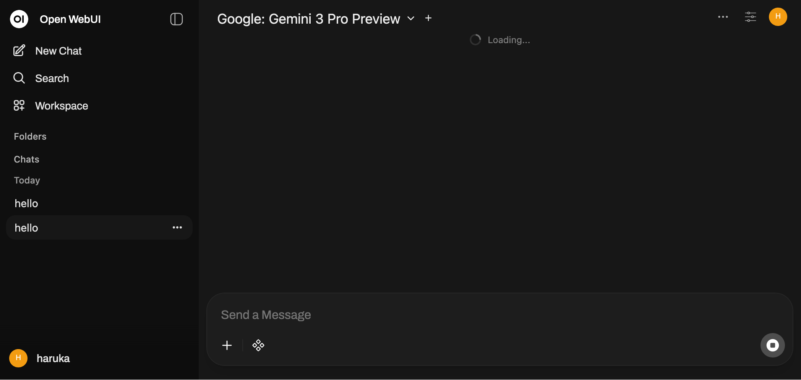

# openwebui-chat-repair

Repairs corrupted OpenWebUI chat exports that fail to open.

**[Launch the repair tool](https://fractuscontext.github.io/openwebui-chat-repair/)**

---

## Background

OpenWebUI stores chat history as a directed graph of message nodes. A `currentId` pointer tracks the active position in the tree. When this pointer becomes invalid or when node references break, OpenWebUI either hangs on an infinite loading spinner or redirects you to the home page entirely.

This tool repairs the underlying JSON export so the chat can be safely re-imported.

**Confirmed affected versions:** v0.7.1–v0.8.10 *(may affect other versions)*.

**Upstream issues:** [#15189](https://github.com/open-webui/open-webui/issues/15189), [#19225](https://github.com/open-webui/open-webui/issues/19225)

---

## What it fixes

### Why chats won't load

There are two primary failure modes:

* **Infinite loading spinner:** The `currentId` pointer references a node that exists in the graph but is unreachable from the root. This is typically caused by a detached subtree after a network interruption or API error mid-generation. OpenWebUI finds the node but cannot reconstruct the path to it, causing it to hang.
* **Redirect to home page:** The `currentId` pointer references a node that no longer exists in the message map at all. OpenWebUI attempts to resolve the pointer, gets a null reference, and hard-crashes back to the index. This is harder to diagnose because the chat simply disappears from view.

The tool resolves both cases by walking the graph to find the largest connected component, then re-assigning `currentId` to the most recent leaf node in that valid component.

### Specific repairs

| Issue | What the tool does |
|---|---|
| `currentId` points to a missing or deleted node | Resolves to the most recent reachable leaf |
| `childrenIds` contains references to non-existent nodes | Strips invalid references |
| `parentId` points to a non-existent node | Nulls the parent pointer, promoting the node to a root |
| Orphaned nodes (unreachable from any root) | Left in place by default; removed completely in **Prune Mode** |

---

## Usage

1. In OpenWebUI, open the broken chat → `...` menu → **Export** → **JSON**.
2. Open the **[repair tool](https://fractuscontext.github.io/openwebui-chat-repair/)**.
3. Drop the exported JSON into the tool.
4. Download the repaired file.
5. In OpenWebUI: **Settings** → **General** → **Import Chats** → select the repaired file.
6. Confirm the chat loads, then delete the old corrupted export.

### Modes

* **Safe Repair (Default):** Fixes broken pointers and removes invalid node references. Preserves all message content, including alternate generation branches.
* **Prune Mode:** Runs the same repairs, then removes all nodes that are not on the active conversation path. Produces a significantly smaller, linear file. Use this if you do not need your regeneration history.

---

## Test File

A reference export is included at [`tests/bad-test-1.json`](./tests/bad-test-1.json) for verifying tool behaviour. It contains a real conversation with the following faults intentionally injected:

| Fault | Node / Field | Expected Behaviour |
|---|---|---|
| `currentId` points to non-existent node | `currentId: "deleted-node-0000"` | Tool resolves to most recent valid leaf (`c228417e...`) |
| `childrenIds` contains a ghost reference | `08fcf711...` → `"fake-missing-child-uuid"` | Broken reference is stripped from `childrenIds` array |
| Orphaned node with non-existent parent | `abandoned-node-1111` → `parentId: "ghost-parent-uuid-9999"` | `parentId` nulled in repair mode; node deleted entirely in prune mode |

**To test manually:** Import `bad-test-1.json` into OpenWebUI without repairing it first. The chat will instantly redirect to the home page (the `currentId` fault triggers the hard-crash path). Run it through the tool, re-import the clean file, and it will open perfectly.

---

## Privacy

The tool runs entirely client-side in your browser. No chat data is transmitted, uploaded, or analyzed externally.
